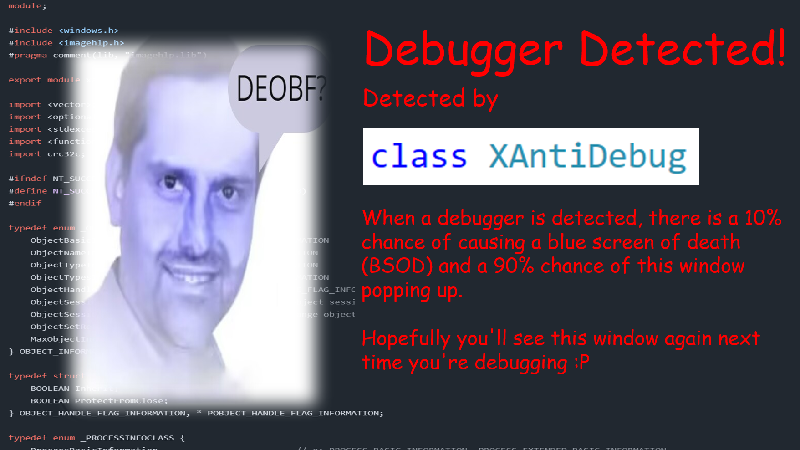

# XAntiDebug

单头文件调试器检测（C++20）



```C++
#include <iostream>
import xantidbg;

const XAntiDebug antidbg_global_instance([]() {
	debug_detected(false);
	});

int main() {
	antidbg_global_instance.sentinel();
	
	XAntiDebug antidbg;

	antidbg_global_instance.sentinel();

	if (antidbg.check_debug()) {
		debug_detected(false);
	}

	antidbg_global_instance.sentinel();
}
```
